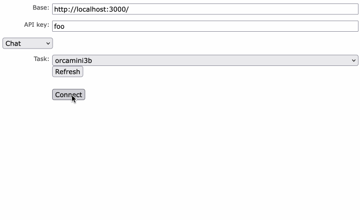
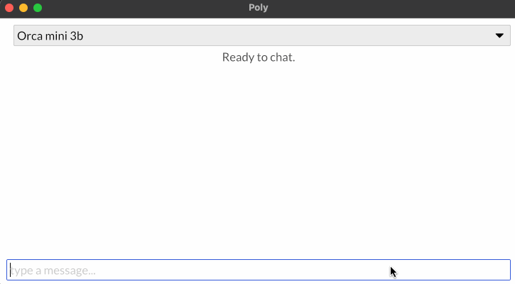
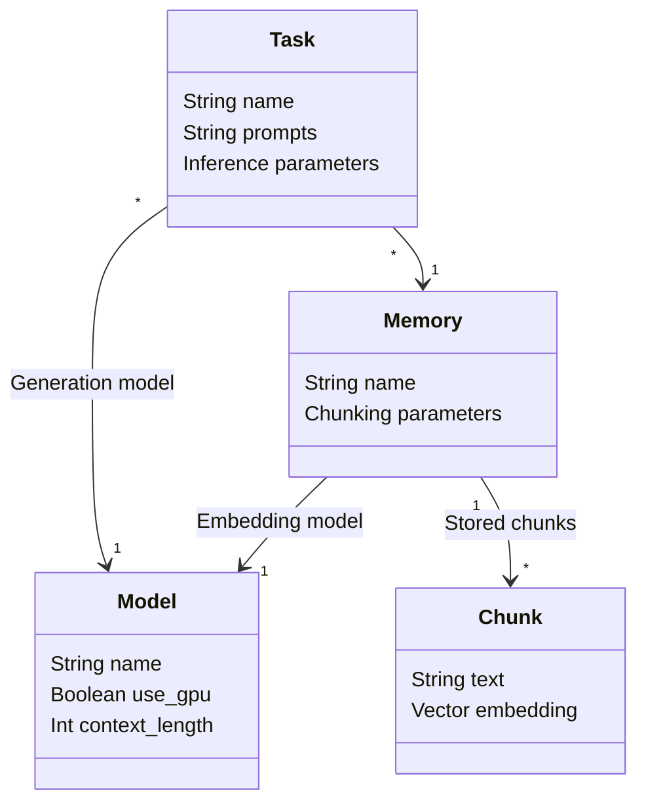
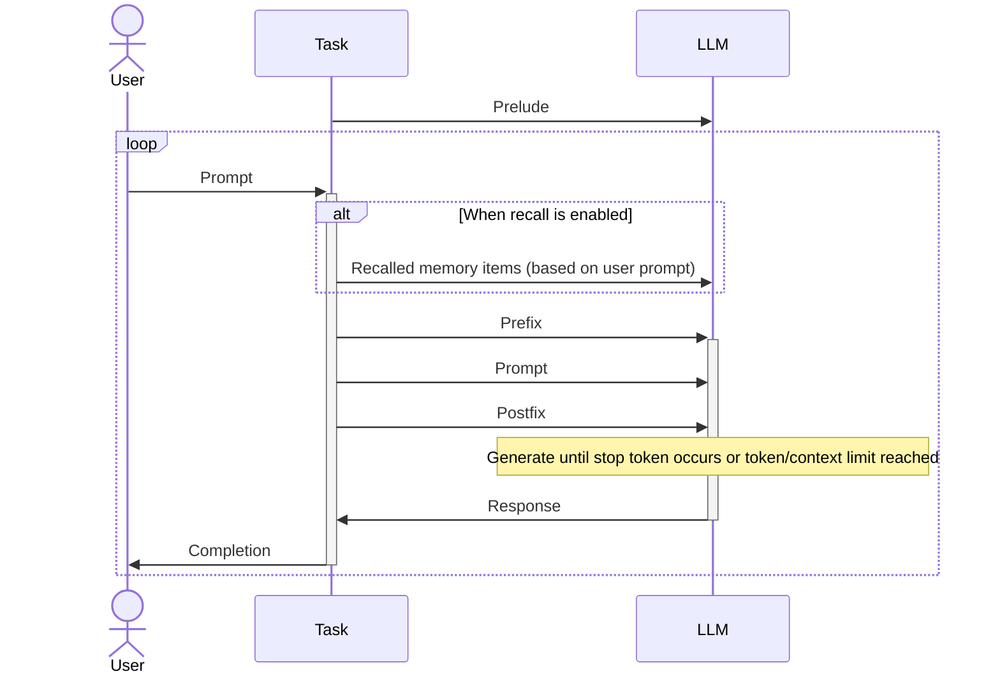
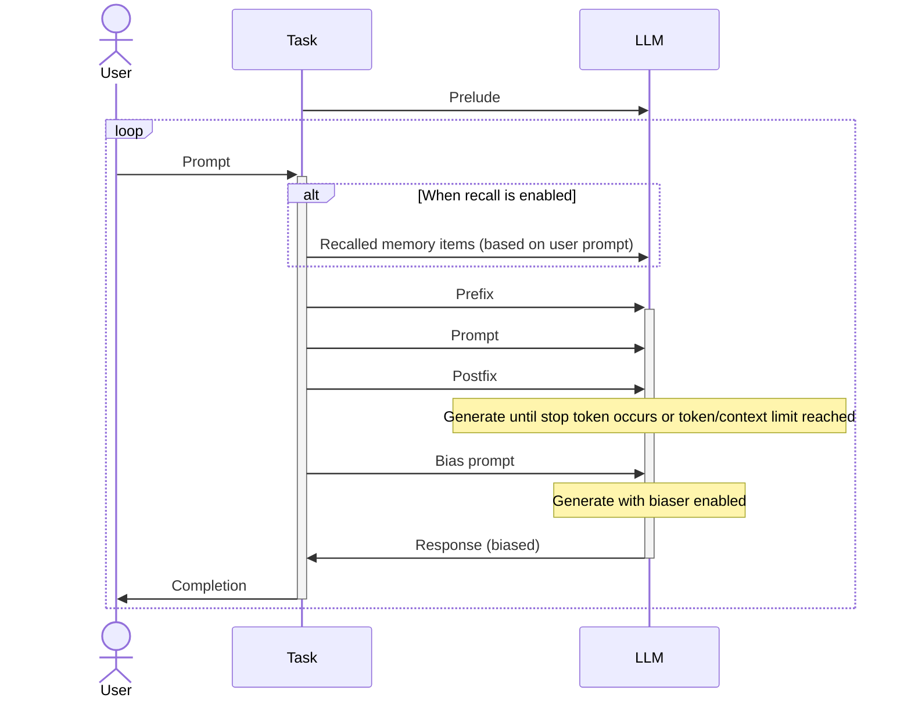
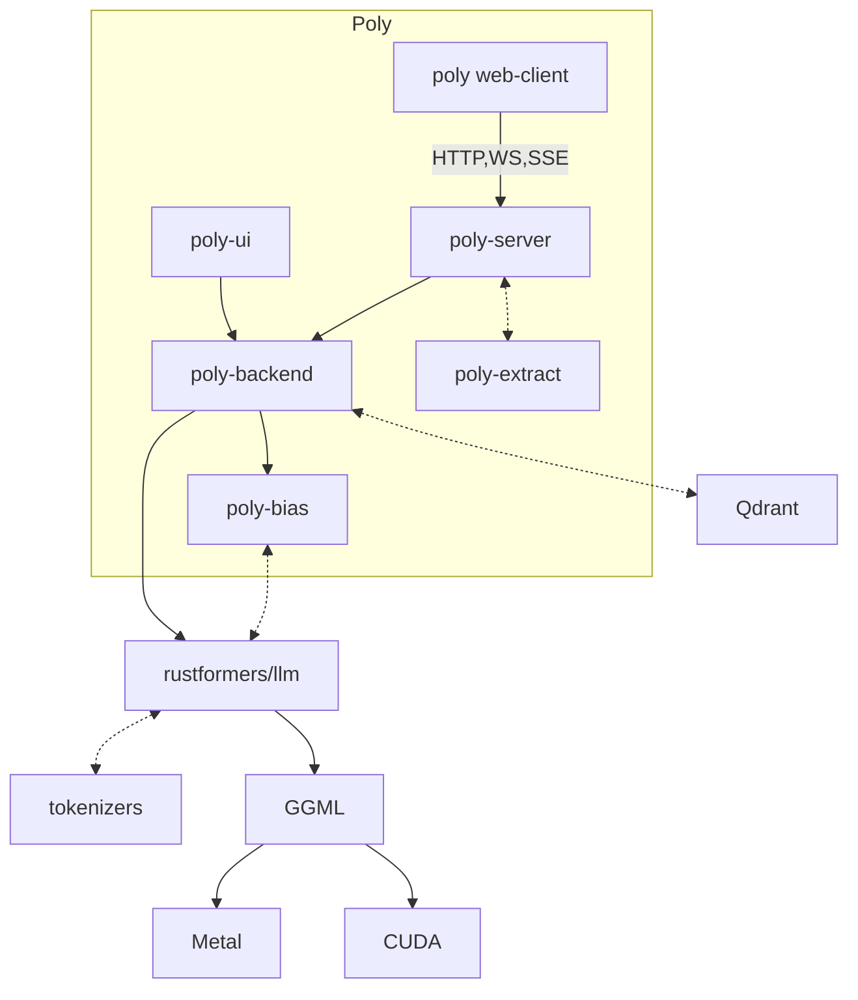

# Poly

Poly is a versatile LLM serving back-end. What it offers:

- High-performance, efficient and reliable serving of multiple local LLM models
- Optional GPU acceleration through either CUDA or Metal
- Configurable LLM completion tasks (prompts, recall, stop tokens, etc.)
- Streaming completion responses through HTTP SSE, chat using WebSockets
- Biased sampling of completion output using JSON schema
- Memory retrieval using vector databases (either built-in file based, or external such as Qdrant)
- Accepts and automatically chunks PDF and DOCX files for storage to memory
- API secured using either static API keys or JWT tokens
- Simple, single binary + config file server deployment, horizontally scalable

Nice extras:

- A web client to easily test and fine-tune configuration
- A single-binary cross platform desktop client for locally running models

Supported models include:

- LLaMa and derivatives (Alpaca, Vicuna, Guanaco, etc.)
- LLaMA2
- RedPajamas
- MPT
- Orca-mini

|                    Web client                     |                  Desktop app                   |
| :-----------------------------------------------: | :--------------------------------------------: |
|  |  |

Sample of a model+task+memory configuration:

```toml
[models.gpt2dutch]
model_path = "./data/gpt2-small-dutch-f16.bin"
architecture = "gpt2"
use_gpu = false

[memories.dutch_qdrant]
store = { qdrant = { url = "http://127.0.0.1:6333", collection = "nl" } }
dimensions = 768
embedding_model = "gpt2dutch"

[tasks.dutch_completion]
model = "gpt2dutch"
prelude = "### System:\nYou are an AI assistant that follows instruction extremely well. Help as much as you can.\n"
prefix =  "\n### User:\n"
postfix = "\n### Response:"
memorization = { memory = "dutch_qdrant", retrieve = 2 }
```

See [config.example.toml](./config.example.toml) for more example configurations.

Custom samplers can be configured using a string-based description, see [here](https://github.com/rustformers/llm/blob/18b2a7d37e56220487e851a45badc46bf9dcb9d3/crates/llm-base/src/samplers.rs#L222). Any biaser (i.e. JSON biaser) is injected as first sampler in the chain.

## Concepts

In Poly, _models_ are LLM models that support basic text generation and embedding operations. Models can be run on the GPU and have specific context lengths, but are otherwise unconfigurable.

A _task_ uses a model in a specific way (i.e. using specific prompts, stop tokens, sampling, et cetera. Tasks are highly configurable. A model may be shared by multiple tasks.

A _memory_ is a database that stores _chunks_ of text, and allows retrieval of such chunks using vector similarity (where each chunk has a vector calculated as an embedding from an LLM). Memories can be re-used between tasks.



The API exposes models, tasks and memories by their name (which is unique within their category).

### Tasks

A task configures the way user input is transformed before it is fed to an LLM and the way the LLM output is transformed before it is returned to the user, in order to perform a specific task. A task can be configured to use (optional) `prelude`, `prefix` and `postfix` prompts. The prelude is fed once to the model for each session. The prefix and postfix are applied to each user input (i.e. each chat message):



When biasing is enabled, an optional `bias prompt` can be configured. When configured the model will be asked to generate a response (following the flow as shown above). This response is however not directly returned to the user. Instead, the bias prompt is then fed, after which the biaser is enabled (and the biased response is returned to the user).



## Architecture

Poly is divided into separate crates that can be used independently:

- [poly-server](./poly-server): Serve LLMs through HTTP and WebSocket APIs (provides `llmd`)
- [poly-backend](./poly-backend): Back-end implementation of LLM tasks
- [poly-extract](./poly-extract): Crate for extracting plaintext from various document types
- [poly-bias](./poly-bias): Crate for biasing LLM output to e.g. JSON following a schema
- [poly-ui](./poly-ui): Simple desktop UI for local LLMs

Applications that want to employ Poly's functionality should use the HTTP REST API exposed by `poly-server`. Rust applications looking to integrate Poly's capabilities could also depend on `poly-backend` directly.



## Authors

- Tommy van der Vorst (vandervorst@dialogic.nl)

## License

Poly is [licensed under the Apache 2.0 license](http://www.apache.org/licenses/LICENSE-2.0) from Git revision `f329d35`
onwards (only). Kindly note that this license provides no entitlement to support whatsoever. If you have any specific
licensing or support requirements, please contact the authors.

We will accept contributions only if accompanied with a written statement that the contributed code is also
(at least) Apache 2.0 licensed.

Specific licenses apply to the following files:

- [./data/gpt2.bin](./data/gpt2.bin): MIT, source [here](https://huggingface.co/marella/gpt-2-ggml), license [here](https://github.com/marella/ctransformers/blob/main/LICENSE).
- [./data/gpt2-small-dutch-f16.bin](./data/gpt2-small-dutch-f16.bin): Apache 2.0, source [here](https://huggingface.co/GroNLP/gpt2-small-dutch-embeddings), license [here](https://github.com/wietsedv/gpt2-recycle/blob/master/LICENSE).
