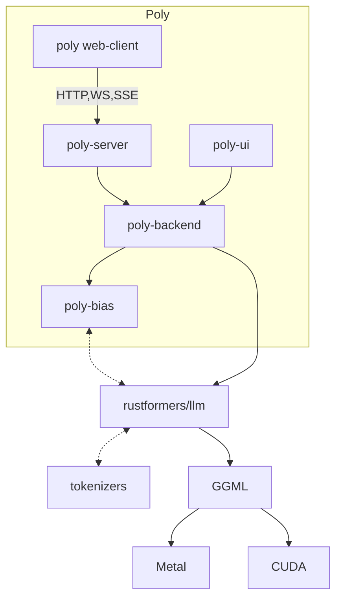

# Poly

Versatile LLM back-end.

- [poly-server](./poly-server): Serve LLMs through HTTP and WebSocket APIs (provides `llmd`)
- [poly-backend](./poly-backend): Back-end implementation of LLM tasks
- [poly-bias](./poly-bias): Crate for biasing LLM output to e.g. JSON following a schema
- [poly-ui](./poly-ui): Simple desktop UI for local LLMs

