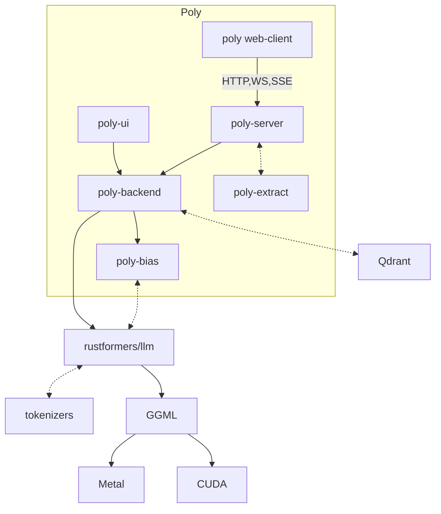

# Poly

Poly is a versatile LLM serving back-end. What it offers:

- High-performance, efficient and reliable serving of multiple local LLM models
- Optional GPU acceleration through either CUDA or Metal
- Configurable LLM completion tasks (prompts, recall, stop tokens, etc.)
- Streaming completion responses through HTTP SSE, chat using WebSockets
- Biased sampling of completion output using JSON schema
- Memory retrieval using vector databases (either built-in file based, or external such as Qdrant)
- Accepts and automatically chunks PDF and DOCX files for storage to memory
- API secured using either static API keys or JWT tokens

Nice extras:

- A web client to easily test and fine-tune configuration
- A single-binary cross platform desktop client for locally running models

Supported models include:

- LLaMa and derivatives (Alpaca, Vicuna, Guanaco, etc.)
- RedPajamas
- MPT
- Orca-mini

See [config.example.toml](./config.example.toml) for example configurations.

## Architecture

- [poly-server](./poly-server): Serve LLMs through HTTP and WebSocket APIs (provides `llmd`)
- [poly-backend](./poly-backend): Back-end implementation of LLM tasks
- [poly-extract](./poly-extract): Crate for extracting plaintext from various document types
- [poly-bias](./poly-bias): Crate for biasing LLM output to e.g. JSON following a schema
- [poly-ui](./poly-ui): Simple desktop UI for local LLMs

